# OndeviceAI2 프로젝트 리뷰 (v2 - 블록 다이어그램 + 타이밍 다이어그램 포함)

> 다이어그램은 `diagrams/` 폴더에 PNG로 저장되어 있습니다. (cairosvg가 이 환경에서 native cairo 라이브러리를 찾지 못해 로드에 실패하여, 동일한 결과물을 내는 matplotlib 기반 렌더러로 대체 생성했습니다.)
>
> - **블록 다이어그램**: 프로젝트별 모듈 계층 구조를 박스+연결선으로 시각화 (흰색=top, 노랑=제어/FSM, 초록=데이터패스/저장소, 파랑=통신 인터페이스, 빨강=외부/센서 인터페이스).
> - **타이밍 다이어그램**: 각 프로젝트에서 처음 등장하는 핵심 개념의 신호 파형 (어두운 배경/clk 파랑/data 초록/control 노랑/reset·error 빨강).

---

## 20260406_gates

### 설계 목표
2-입력 조합논리 게이트(AND/NAND/OR/NOR/XOR/XNOR/NOT)를 한 모듈에서 동시에 구현해보는 첫 시뮬레이션 환경 연습 프로젝트.

### 핵심 설계 결정
- `assign` 연속 할당문만으로 모든 출력을 표현 — 플립플롭 없는 순수 조합회로이므로 클럭이 필요 없음.
- 7개의 출력(y0~y6)을 한 모듈에 몰아넣어 Verilog 연산자(& | ^ ~)와 비트 연산 문법을 한 번에 익히도록 구성.
- 각 출력에 `//and`, `//nand` 식으로 인라인 주석을 달아 연산자-게이트 대응을 기록.

### 모듈 구조
- `gates` (top, 유일한 모듈): 입력 a, b → 출력 y0~y6. 하위 모듈 없음, 계층 1단계.

### 블록 다이어그램


### 타이밍 다이어그램
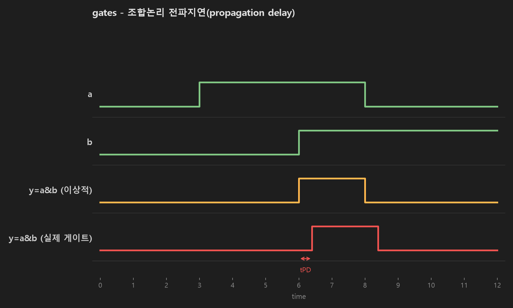

RTL 시뮬레이션에서는 `assign`이 델타사이클 내에 즉시 반영되지만, 실제 합성된 게이트는 유한한 전파지연(tPD)을 가진다는 개념 차이를 보여줍니다. a, b가 모두 1이 되는 구간에서 이상적인 y(주황)는 즉시 반응하고, 실제 게이트의 y(빨강)는 tPD만큼 늦게 반응합니다.

### 핵심 모듈 개념 및 사용 이유

**gates (조합논리 프리미티브)**
- 개념: 입력이 바뀌면 지연 없이(이상적으로) 즉시 출력이 바뀌는, 메모리(상태)가 없는 순수 논리 회로. `&`, `|`, `^`, `~` 연산자가 각각 AND/OR/XOR/NOT 게이트에 대응.
- 사용 이유: 이후 모든 프로젝트의 최소 단위 빌딩블록이 되는 게이트 문법과 비트 연산자를 가장 단순한 형태로 익히기 위해 사용.
- 핵심 동작 원리: `assign`은 우변 신호가 바뀔 때마다 좌변을 재계산하는 지속적 할당이며, 실제 하드웨어에서는 각 게이트를 신호가 통과하는 데 걸리는 시간(전파지연)이 존재.

### 검증 방법
- `tb_gates.v`: a, b를 00→01→10→11 순서로 10ns 간격 변경하는 전수 입력 테스트(2비트 조합 4가지 모두 인가). 별도 assert/self-check 없이 파형으로 육안 확인하는 방식.

### 배운 점 / 주요 개념
- Verilog 비트 연산자(&, |, ^, ~)와 `assign` 연속 할당 문법.
- 테스트벤치의 기본 골격(DUT 인스턴스화, `initial` 블록으로 자극 인가, `$finish`)과 시뮬레이션 환경 자체에 익숙해지는 것이 목적.

---

## 20260407_adder

### 설계 목표
1비트 반가산기부터 8비트 가산기, 그리고 그 합산 결과를 4자리 FND(7-세그먼트)에 표시하는 것까지 계층적으로 확장하는 프로젝트. 게이트 레벨 → 구조적(structural) 설계 → 응용(FND 표시) 순서로 난이도를 올려가는 학습 흐름.

### 핵심 설계 결정
- `half_adder`를 원시 게이트(`xor`, `and` 프리미티브)로 구현하고, `full_adder`는 `half_adder` 2개 + OR로 구성 — RTL 추상화 이전에 게이트 프리미티브 문법을 먼저 연습.
- `full_adder_4bit`는 `full_adder`를 4개 리플캐리(ripple-carry) 방식으로 체이닝, `adder_8bit`는 그 4비트 블록을 2개 이어붙여 8비트로 확장 — carry 신호(`w_c0`)를 명시적으로 손으로 연결하며 캐리 전파 구조를 체득.
- `fnd_control.v` 한 파일 안에 `fnd_controller`(top) + `clk_div_1khz`(분주기) + `counter_4`(자릿수 선택 카운터) + `decoder_2x4`(공통단자 디코더) + `digit_spliter`(나눗셈으로 자릿수 분해) + `mux_4x1` + `bcd`(세그먼트 디코더)까지 7개 모듈을 함께 정의 — FND 동적 구동(digit multiplexing)에 필요한 모든 서브블록을 한 파일에서 관리.
- `digit_spliter`는 `%`, `/` 연산자로 BCD 자릿수를 분해(합성 시 나눗셈기 소모가 크지만 학습 단계에서는 가독성 우선).
- 클럭 분주는 50,000카운트마다 토글하여 100MHz 기준 1kHz를 만드는 전형적인 분주기 패턴.

### 모듈 구조
```
adder_fnd (top)
├─ fnd_controller (U_fnd_cntl)
│   ├─ digit_spliter
│   ├─ mux_4x1
│   ├─ bcd
│   ├─ clk_div_1khz
│   ├─ counter_4
│   └─ decoder_2x4
└─ adder_8bit (U_ADDER_8BIT)
    └─ full_adder_4bit ×2
        └─ full_adder ×4
            └─ half_adder ×2 (게이트 프리미티브)
```
※ `adder_fnd.v` 파일은 내용이 비어 있는 빈 모듈(템플릿 잔재)이며, 실제 top 로직은 `adder.v` 안에 동일한 이름(`adder_fnd`)으로 정의되어 있음 — 파일명과 실제 구현 위치가 어긋나 있는 점은 정리가 필요.

### 블록 다이어그램
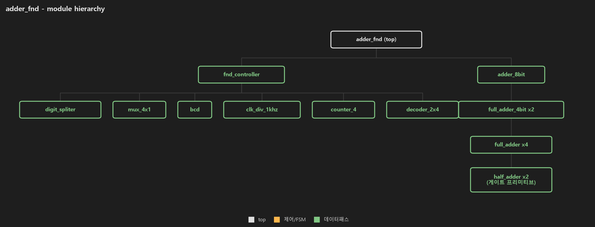

### 타이밍 다이어그램
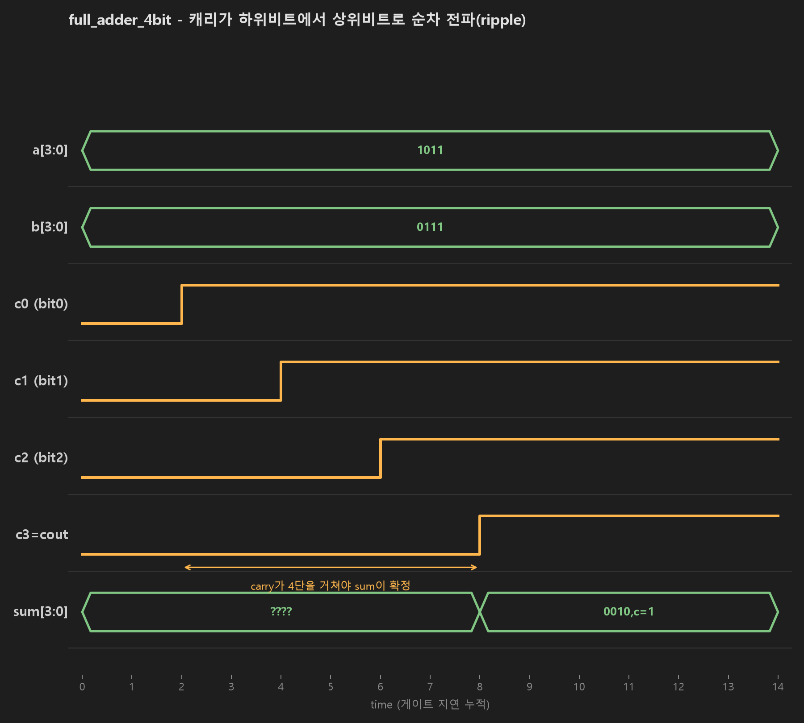

4비트 가산기에서 캐리(c0→c1→c2→c3)가 하위 비트에서 상위 비트로 한 단씩 순차적으로 전파되는 모습을 보여줍니다. sum 값은 캐리가 4단을 모두 통과한 뒤에야 확정되며, 이는 리플캐리 가산기의 속도가 비트폭에 비례해 느려지는(critical path가 길어지는) 근본 원인입니다.

### 핵심 모듈 개념 및 사용 이유

**half_adder / full_adder (리플캐리 가산기)**
- 개념: half_adder는 캐리 입력 없이 두 비트를 더해 합(sum)과 캐리(carry)를 내는 최소 단위. full_adder는 half_adder 2개로 이전 자리의 캐리(cin)까지 받아 더하는 완전한 1비트 가산기.
- 사용 이유: 임의 비트폭의 가산기를 만들 수 있는 가장 기본적인 빌딩블록이며, "구조적 설계(하위 모듈을 인스턴스화해 상위 모듈을 구성)" 문법을 처음 연습하기 위해 사용.
- 핵심 동작 원리: n비트 가산기는 1비트 full_adder를 n개 이어붙이고, 하위 자리의 carry-out을 상위 자리의 carry-in에 연결(리플캐리)해서 만든다.

**fnd_controller (FND 동적 구동)**
- 개념: 4자리 7-세그먼트 표시장치를 각 자리마다 별도 배선하지 않고, 공통 세그먼트 라인을 시분할로 빠르게 전환(멀티플렉싱)하며 잔상 효과로 4자리가 동시에 켜진 것처럼 보이게 하는 회로.
- 사용 이유: FPGA 보드에서 흔히 쓰이는 4자리 FND를 최소 배선으로 구동하기 위해 필요 — 자리 수만큼 디코더를 두면 배선/자원이 낭비됨.
- 핵심 동작 원리: 1kHz로 분주된 클럭마다 counter_4가 표시할 자리(0~3)를 순환시키고, 그 자리에 해당하는 값을 mux_4x1로 골라 BCD 디코더에 넣는 동시에, decoder_2x4가 그 자리의 공통단자만 활성화(active-low)시킨다.

### 검증 방법
- `tb_adder_8bit.v`: a, b를 0~255 이중 for문으로 전수 조합(65,536가지) 인가하는 전수 검증(exhaustive test) — 8비트 가산기이므로 전체 케이스를 다 돌릴 수 있음을 보여주는 예시.
- `tb_clk_div.v`: reset 인가 후 분주 클럭 파형을 육안 확인하는 방식.
- `tb_adder_fnd.v`, `tb_adder_fnd2.v`, `tb_full_adder_4bit.v`, `tb_adder.v`: 다수가 빈 템플릿이거나 미완성 상태 — 초반 실습에서 테스트벤치를 항목별로 만들다 만 흔적으로 보임.

### 배운 점 / 주요 개념
- 게이트 프리미티브(`xor`, `and`)와 구조적 인스턴스화(포트 연결)를 통한 계층 설계.
- 리플캐리 가산기의 캐리 전파 구조.
- FND 동적 구동을 위한 분주-카운트-디코더-먼스 조합 패턴(멀티플렉싱 디스플레이의 정석 구조).
- 전수 테스트(exhaustive test)가 가능한 비트폭에서는 반복문으로 모든 입력 조합을 돌려보는 검증 방식.

---

## 20260415_pratice

### 설계 목표
3-state 버스 드라이버(tri-state bus driver)와 4:1 멀티플렉서라는 두 개의 독립적인 조합회로 문법을 연습하는 실습 프로젝트. (테스트벤치 없이 소스만 존재 — 실습용 단위 모듈 모음)

### 핵심 설계 결정
- `busdriver`: `assign ... ?:` 삼항연산자로도 구현 가능하지만(주석 처리로 남겨둠), 실제로는 `bufif1` 게이트 프리미티브를 8비트 폭으로 배열 인스턴스화(`bf1[7:0]`, `bf2[7:0]`)하여 두 드라이버가 같은 버스(`bus_data`)를 en_a/en_b로 조건부 구동하는 실제 3-state 버스 구조를 구현.
- `mux4x1`: 삼항연산자 버전과 `if-else if` 버전을 모두 주석으로 남겨두고, 최종적으로는 매 사이클 `mux_out`을 0으로 초기화한 뒤 독립된 `if`문 4개로 각 sel 값을 처리하는 방식 채택 — 조합회로에서 디폴트 값을 먼저 대입해 래치(latch) 생성을 막는 코딩 스타일을 연습.

### 모듈 구조
- `busdriver` (단독 모듈): data_a, data_b, en_a, en_b → bus_data. 하위 모듈 없음.
- `mux4x1` (단독 모듈): a,b,c,d,sel → mux_out. 하위 모듈 없음.
※ 두 모듈은 서로 연결되지 않은 별개의 실습 파일이며, 최상위 통합 모듈이나 테스트벤치는 없음.

### 블록 다이어그램


### 타이밍 다이어그램
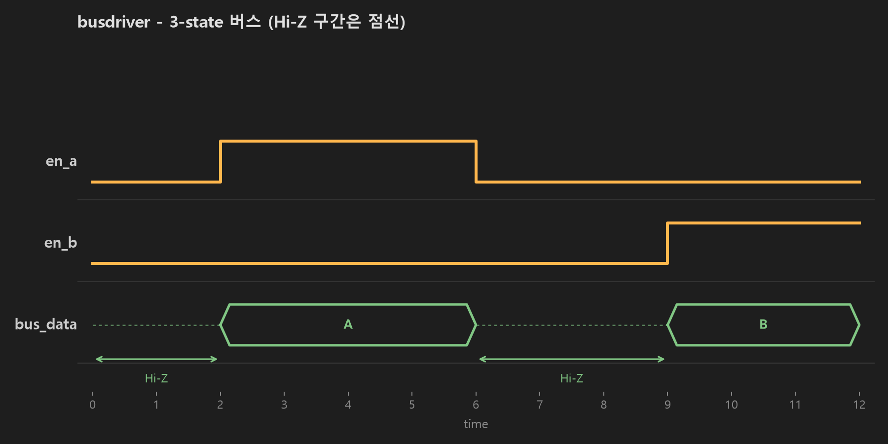

en_a, en_b가 동시에 1이 될 수 없다는 전제 하에, 어느 쪽도 활성화되지 않은 구간(Hi-Z)에서는 버스가 점선으로 표시된 "떠 있는" 상태가 되고, en_a 또는 en_b가 1일 때만 각각 A, B 값이 버스에 실리는 모습을 보여줍니다.

### 핵심 모듈 개념 및 사용 이유

**busdriver (3-state 버스)**
- 개념: 여러 소스가 같은 물리적 배선(버스)을 공유하되, 매 순간 오직 하나의 소스만 그 배선을 구동(drive)하고 나머지는 Hi-Z(고임피던스, 전기적으로 끊긴 상태)로 빠지는 구조.
- 사용 이유: 여러 장치가 하나의 데이터 버스를 공유해야 하는 상황(예: 메모리 버스, 다중 디바이스 통신)에서 신호 충돌 없이 배선을 절약하기 위해 필요.
- 핵심 동작 원리: `bufif1(out, in, en)`은 en=1일 때만 in을 out으로 전달하고, en=0이면 out을 Hi-Z(1'bz)로 만든다. 두 드라이버의 인에이블 신호가 동시에 1이 되지 않도록 설계자가 보장해야 버스 충돌(contention)이 발생하지 않는다.

### 검증 방법
- 테스트벤치 없음 — 문법 실습 단계로, 시뮬레이션 검증 이전의 코드 작성 연습 자체가 목적으로 보임.

### 배운 점 / 주요 개념
- tri-state 버스와 `bufif1` 게이트 프리미티브를 이용한 버스 충돌 방지 구조.
- 조합회로에서 `always @(*)`에 디폴트 대입을 넣어 원치 않는 래치 생성을 막는 코딩 관용구.
- 같은 로직을 삼항연산자 / if-else if / 병렬 if로 표현하는 여러 스타일 비교.

---

## 20260409_countter_10000

### 설계 목표
0~9999를 증가/감소 카운트하며 FND에 표시하는 카운터. 버튼 3개(run/stop, clear, mode)로 동작을 제어하는, 이후 스톱워치 프로젝트의 원형이 되는 FSM+데이터패스 구조 실습.

### 핵심 설계 결정
- 컨트롤 유닛(FSM)과 데이터패스(카운터)를 분리하는 고전적인 FSMD(FSM+Datapath) 구조 채택 — `control_unit`이 버튼 입력을 받아 `o_mode`(업/다운), `o_run_stop`, `o_clear` 같은 원샷 제어 신호를 만들고, `datapath`는 그 신호만 받아 순수하게 카운트 동작만 수행.
- `control_unit`은 STOP/RUN/CLEAR/MODE 4개 상태의 Moore형 FSM. RUN 상태에서 버튼을 다시 누르면 STOP으로, CLEAR/MODE는 원샷 동작 후 자동으로 STOP으로 복귀하는 펄스성 상태로 설계 — 버튼 입력을 "레벨"이 아닌 "이벤트"로 다루기 위함.
- `button_debounce`: 100kHz로 분주한 클럭으로 입력을 8비트 시프트 레지스터에 채운 뒤 전부 1일 때만(`&sync_reg`) 안정 상태로 인정하고, 상승엣지 검출로 1클럭짜리 펄스를 생성.
- `tick_counter`는 `i_mode`에 따라 up/down 카운트를 분기하고 9999↔0 롤오버를 처리.
- `clk_tick_gen`의 카운트 비교값이 `10_000_000`(1초, 10Hz 근거)이 아니라 주석 처리되고 `1000`으로 되어 있음 — 시뮬레이션 확인용으로 임시로 줄여둔 디버그 흔적.
- FND 표시부(`fnd_control.v`)는 adder 프로젝트와 동일한 구조를 그대로 재사용(입력 폭만 8비트→14비트로 확장) — 검증된 서브모듈을 다음 프로젝트에 이식하는 재사용 패턴.

### 모듈 구조
```
counter_10000 (top)
├─ button_debounce ×3 (run/stop, clear, mode 각각)
├─ control_unit (FSM: STOP/RUN/CLEAR/MODE)
├─ fnd_controller (digit_spliter/mux_4x1/bcd/clk_div_1khz/counter_4/decoder_2x4)
└─ datapath
    ├─ tick_counter (0~9999 up/down 카운터)
    └─ clk_tick_gen (분주로 tick pulse 생성)
```

### 블록 다이어그램
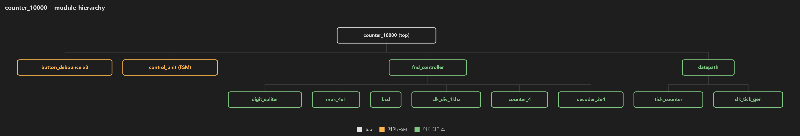

### 타이밍 다이어그램
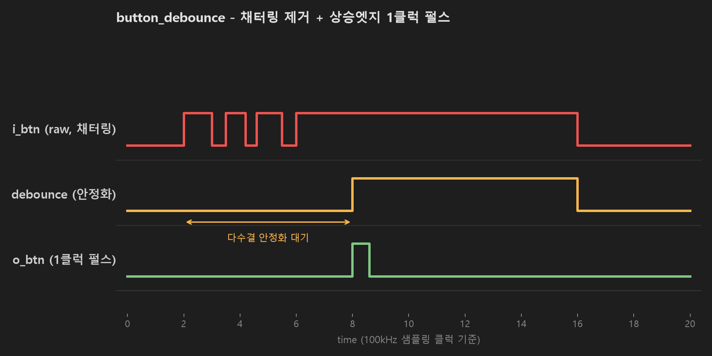

버튼을 누르는 순간의 기계적 채터링(짧은 시간 내 여러 번 토글)이 raw 입력에 나타나지만, 다수결 안정화 로직을 거친 debounce 신호는 채터링이 끝나고 일정 시간 유지된 뒤에야 안정적으로 1이 되고, 최종 출력 o_btn은 그 상승엣지에서 딱 1클럭 폭의 펄스만 냅니다.

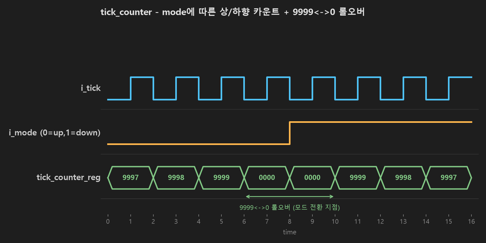

i_mode가 0(업)일 때는 9999에서 0으로, 1(다운)일 때는 0에서 9999로 롤오버하는 양방향 카운터의 동작을 보여줍니다.

### 핵심 모듈 개념 및 사용 이유

**button_debounce (채터링 제거)**
- 개념: 기계식 버튼은 눌리는 순간 접점이 여러 번 튀는(bounce) 물리 현상이 있어, 이를 그대로 읽으면 한 번 누른 것이 여러 번 눌린 것으로 오인식됨. 이를 걸러내 "안정된 신호가 일정 시간 유지될 때만" 진짜 입력으로 인정하는 회로.
- 사용 이유: 버튼 하나의 오작동이 카운터 값을 여러 번 튀게 만들거나 모드를 여러 번 전환시키는 문제를 막기 위해, 물리 버튼을 쓰는 모든 프로젝트에서 필수적으로 앞단에 필요.
- 핵심 동작 원리: 저속 클럭(100kHz)으로 입력을 8비트 시프트 레지스터에 계속 밀어 넣고, 8비트가 모두 1일 때만("&" 연산) 안정된 것으로 판단한 뒤, 그 안정 신호의 상승엣지를 검출해 1클럭짜리 펄스로 변환.

**control_unit (FSM 기반 제어 유닛)**
- 개념: 시스템의 "지금 무슨 동작을 해야 하는가"를 상태(state)로 표현하고, 입력에 따라 상태를 전이시키며 그에 맞는 제어 신호를 출력하는 유한상태기계.
- 사용 이유: 여러 버튼의 조합과 순서에 따라 달라지는 동작(정지→실행→정지, 초기화, 모드전환)을 조건문만으로 처리하면 코드가 복잡해지므로, 상태로 나눠 각 상태에서 해야 할 일만 명확히 기술하기 위해 사용.
- 핵심 동작 원리: 클럭 엣지마다 현재 상태(c_state)를 다음 상태(n_state)로 갱신하는 순차 블록과, 현재 상태+입력으로 다음 상태 및 출력을 계산하는 조합 블록 두 개로 나누어 설계(전형적인 2-process FSM).

**tick_counter (업/다운 카운터)**
- 개념: 매 tick마다 값을 1씩 증가 또는 감소시키고, 최대/최소값에 도달하면 반대쪽 끝으로 되돌아가는(롤오버) 카운터.
- 사용 이유: 스톱워치, 시계 등 "일정 범위를 반복해서 세는" 모든 회로의 기본 구성요소이기 때문에 사용.
- 핵심 동작 원리: mode 신호로 증가/감소를 선택하고, 카운트 값이 경계(0 또는 최댓값)에 도달했는지를 조합 로직으로 매 tick마다 검사해 롤오버를 처리.

### 검증 방법
- `tb_btn_debounce.v`: 버튼을 누른 상태를 10,000클럭 동안 유지해 디바운스 후 출력이 안정적으로 나오는지 확인.
- `tb_counter_10000.v`: reset 해제 후 RUN→STOP→MODE 전환→다시 RUN→STOP→CLEAR 순서로 버튼 이벤트를 순차 인가하며 카운터가 방향 전환 및 초기화되는 전체 시나리오를 시간 지연으로 시뮬레이션.
- `tb_tick_gen.v`, `tb_datapath.v`도 별도로 존재(개별 서브모듈 단위 테스트).

### 배운 점 / 주요 개념
- FSM(제어)과 데이터패스(연산)를 분리하는 설계 방법론.
- 버튼 디바운스의 표준 구현(분주+시프트레지스터 다수결+에지 검출).
- Moore FSM에서 "원샷 이벤트성 상태"를 두어 레벨 입력을 펄스로 변환하는 패턴.
- 시뮬레이션 편의를 위해 타이밍 상수를 임시로 줄여두고 최종 값으로 되돌리는 것을 잊지 않아야 한다는 교훈.

---

## 20260413_fsm_led

### 설계 목표
스위치 입력 조합에 따라 상태를 전이하며 LED 패턴을 출력하는 5-상태 FSM(`fsm_led`)과, 두 개의 연속된 0 또는 1을 검출하는 오버래핑 시퀀스 디텍터(`seq_det_mealy`)를 통해 Mealy/Moore FSM 설계를 연습.

### 핵심 설계 결정
- `fsm_led`: STATE_A~E 5개 상태를 스위치 값(sw)으로 전이시키되, 출력(`led_next`)을 상태천이 조건문 안에서 함께 대입 — Moore 방식(상태에만 의존한 출력, 주석 처리되어 폐기됨)과 Mealy 방식(상태+입력에 의존한 출력)을 모두 코드에 남겨두고 최종적으로 Mealy 방식을 채택.
- 상태 레지스터 갱신에서 `current_state = next_state`를 블로킹 대입(`=`)으로, `led_reg <= led_next`는 논블로킹(`<=`)으로 섞어 쓴 점은 코딩 스타일상 주의가 필요.
- `seq_det_mealy`: start → rd0_once/rd1_once → rd0_twice/rd1_twice 5상태로 "00" 또는 "11" 연속 2비트를 검출하는 전형적 Mealy FSM.

### 모듈 구조
- `fsm_led` (단독 모듈): clk, rst, sw[2:0] → led[2:0]. 하위 모듈 없음, FSM 단일 모듈.
- `seq_det_mealy` (단독 모듈): clk, rst, din_bit → dout_bit. 하위 모듈 없음.

### 블록 다이어그램
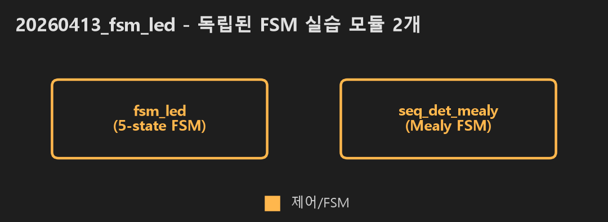

### 타이밍 다이어그램
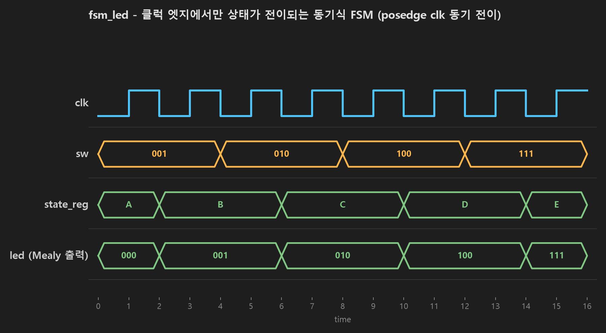

이 프로젝트의 핵심은 새로운 하드웨어 개념보다는 "같은 FSM을 Moore와 Mealy 어느 쪽으로 설계하느냐"의 비교이므로, 다이어그램은 counter_10000에서 이미 등장한 FSM 개념 위에 "상태 전이는 오직 posedge clk에서만 일어난다"는 동기식 설계의 대원칙을 강조합니다. sw가 클럭 사이에 바뀌어도 state_reg는 다음 클럭 엣지까지 이전 값을 유지합니다.

### 핵심 모듈 개념 및 사용 이유

**Moore vs Mealy FSM (출력 방식의 차이)**
- 개념: Moore FSM은 출력이 오직 "현재 상태"에만 의존하고, Mealy FSM은 출력이 "현재 상태 + 현재 입력"에 함께 의존한다. (FSM 자체의 개념은 counter_10000의 control_unit에서 이미 다룸 — 여기서는 출력을 만드는 두 가지 방식의 차이가 새로 등장하는 개념.)
- 사용 이유: Mealy는 입력 변화에 클럭 지연 없이 즉시 반응할 수 있어 상태 수를 줄일 수 있는 반면, Moore는 출력이 클럭에 동기되어 글리치가 적고 타이밍 분석이 쉬움 — 요구사항(반응속도 vs 안정성)에 따라 선택.
- 핵심 동작 원리: Moore는 `case(state) ... output = ...` 형태로 상태만 보고 출력을 정하고, Mealy는 `case(state) if(input) output = ...` 형태로 상태 전이 로직 안에서 입력값까지 함께 검사해 출력을 결정한다.

### 검증 방법
- `tb_fsm_led.v`: A→B→C→D→E→A 정상 경로뿐 아니라 중간에 A→C, C→D→A, D→B 등 다양한 상태 우회 경로를 스위치 값으로 순차 인가해 상태머신의 여러 전이 조건을 폭넓게 검증.
- `tb_fsm_mealy_01.v`(모듈명은 `tb_dut`): din_bit를 다양한 시간 간격으로 토글해 랜덤에 가까운 비트열을 흘려보내며 시퀀스 검출 동작을 파형으로 확인.

### 배운 점 / 주요 개념
- Moore FSM(출력이 상태에만 의존)과 Mealy FSM(출력이 상태+입력에 의존)의 차이를 같은 문제에 두 방식으로 구현해보며 체득.
- 상태 전이 로직과 출력 로직을 한 `case`문 안에 합칠 때 발생할 수 있는 코드 가독성/유지보수 트레이드오프.
- 클럭 동기 블록 내 블로킹/논블로킹 대입 혼용의 위험성.

---

## non_overlapping_seq_detect_1010

### 설계 목표
"1010" 논오버래핑(non-overlapping) 시퀀스 디텍터를 Moore 방식과 Mealy 방식 두 가지로 각각 구현해 비교하고, 별도로 버튼 3개짜리 제어 FSM(`control_unit`)을 함께 연습한 프로젝트.

### 핵심 설계 결정
- `moore.v`: STATE_A~E 5상태로 "1010" 패턴을 추적하며, 출력(led)은 오직 STATE_E에서만 1이 되는 순수 Moore 방식.
- `mealy.v`: STATE_A~D 4상태만으로 동일 패턴을 검출 — Mealy가 Moore보다 상태 수를 하나 줄일 수 있음을 실제 상태 수 차이(5개 vs 4개)로 보여주는 학습 포인트.
- `control_unit.v`: 카운터 프로젝트와 유사하게 STOP/RUN/MODE/CLEAR 4상태 FSM으로 버튼 이벤트를 처리 — 이후 스톱워치 프로젝트의 컨트롤 유닛 원형을 재구현.

### 모듈 구조
- `moore`(단독): clk, rst, sw → led.
- `mealy`(단독): clk, rst, sw → led.
- `control_unit`(단독): clk, rst, btnD/btnL/btnR → run_stop/clear/mode.

### 블록 다이어그램
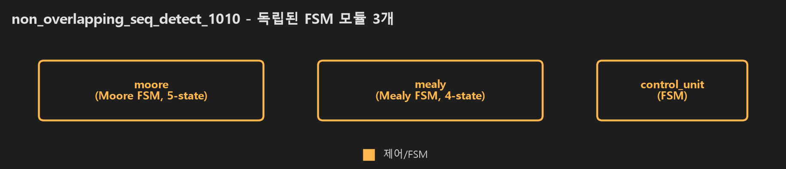

### 타이밍 다이어그램
새로 등장하는 하드웨어 개념은 없음(이미 20260413_fsm_led에서 Moore/Mealy 타이밍을 다룸) — 별도 다이어그램은 생략합니다.

### 핵심 모듈 개념 및 사용 이유
새로운 모듈 개념 없음 — 이전 프로젝트의 FSM/Moore·Mealy 개념을 "1010 시퀀스 검출"이라는 다른 문제에 재적용한 실습.

### 검증 방법
- `tb_moore.v`, `tb_mealy.v`: sw 입력을 시간차를 두고 토글하며 1010 패턴 검출 시점을 파형으로 확인.
- `tb_control_unit.v`: run_stop 버튼을 두 번 눌러 RUN→STOP 전환을 확인하고, 이어서 mode·clear 버튼을 순서대로 눌러 각 상태 전이를 검증하는 시나리오 테스트.

### 배운 점 / 주요 개념
- 동일한 문제(1010 검출)를 Moore와 Mealy로 각각 구현해보며 "Mealy는 상태 수가 적지만 출력이 입력에 즉시 반응하고, Moore는 상태 수가 늘지만 출력이 한 클럭 지연되며 안정적"이라는 트레이드오프를 직접 코드로 비교.
- `moore.v`의 다음상태 case문 `default: current_state = next_state;`는 조합 블록 안에서 상태 레지스터를 직접 블로킹 대입하는 실수성 코드로, FSM에서 `default`절은 반드시 `next_state`(또는 출력)에만 대입해야 한다는 교훈을 주는 사례.
- `control_unit.v`의 출력 조합 블록에서 STATE_run에 진입할 때 `clear`가 명시적으로 0으로 재설정되지 않는 등, 조합 로직 case문에서 모든 신호를 모든 분기마다 대입하지 않으면 래치가 생길 수 있다는 점도 함께 확인할 수 있는 코드.

---

## 20260416_stop_watch

### 설계 목표
스톱워치(경과시간 측정, up/down 카운트)와 손목시계(시각 설정, 시/분/초 개별 증감)를 하나의 보드에서 스위치로 전환해가며 사용하는 통합 시계 프로젝트. FND에 msec/sec/min/hour를 표시.

### 핵심 설계 결정
- 시/분/초/밀리초 4단 카운터를 `tick_counter`(스톱워치용)와 `tick_counter_watch`(시계용)로 각각 매개변수화된(`TIMES`, `BIT_WIDTH`) 재사용 모듈로 설계하고, 하위 카운터의 `o_tick`을 상위 카운터의 `i_tick`에 체이닝하여(msec→sec→min→hour) 캐스케이드 카운터 구조를 구성.
- 스톱워치용 `tick_counter`는 `i_mode`(업/다운)에 따라 카운트 방향을 바꾸는 반면, 시계용 `tick_counter_watch`는 `i_up`/`i_down` 두 개의 독립 입력으로 시각을 직접 조정.
- `top_stopwatch_watch`에서 스톱워치 데이터패스와 시계 데이터패스를 둘 다 인스턴스화한 뒤 `fnd_mux`(sw[1] 기준 2:1 mux)로 표시할 값만 선택.
- `control_unit_fsm`은 STOP/RUN/CLEAR/MODE(스톱워치용)와 NORMAL/HOUR/MIN/SEC(시계용) 8개 상태를 하나의 FSM에 통합하고, `sw` 스위치로 두 그룹 사이를 전환.

### 모듈 구조
```
top_stopwatch_watch (top)
├─ button_debounce ×4 (R/L/U/D)
├─ control_unit_fsm (8-state FSM: 스톱워치 4 + 시계 4)
├─ stopwatch_datapath
│   ├─ tick_counter ×4 (msec/sec/min/hour, 캐스케이드)
│   └─ tick_gen_100hz
├─ watch_datapath
│   ├─ tick_counter_watch ×4 (msec/sec/min/hour, 캐스케이드)
│   └─ tick_gen_watch
├─ fnd_mux ×4 (스톱워치/시계 표시값 선택)
└─ fnd_controller (표시)
```

### 블록 다이어그램
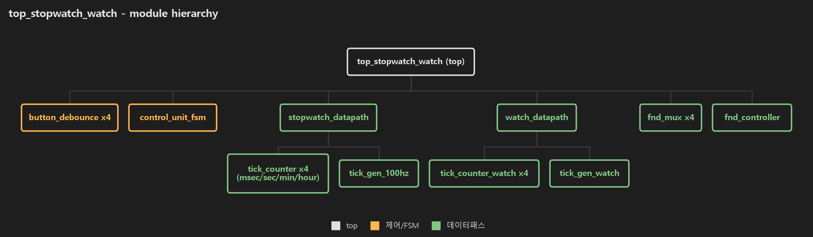

### 타이밍 다이어그램
tick 전파 자체는 counter_10000에서 이미 다뤘고, 이 프로젝트의 새 개념인 "여러 단을 체이닝한 캐스케이드 카운터"는 개념적으로 20260407_adder의 ripple-carry 전파 다이어그램과 같은 원리(하위 단의 out이 상위 단의 in이 되는 구조)이므로 별도 다이어그램은 생략합니다.

### 핵심 모듈 개념 및 사용 이유

**캐스케이드(Cascaded) 카운터**
- 개념: 여러 개의 카운터를 "하위 카운터가 한 바퀴 다 돌았을 때 나오는 신호(o_tick)"로 다음 카운터를 1씩 증가시키는 방식으로 줄줄이 연결하는 구조 (msec가 100까지 차면 sec가 1 증가, sec가 60까지 차면 min이 1 증가...).
- 사용 이유: 시/분/초/밀리초처럼 진법이 서로 다른(24진법, 60진법, 100진법) 다단 카운터를 하나의 큰 카운터로 만드는 대신, 같은 구조의 작은 카운터를 여러 개 재사용해 조합하기 위해 사용.
- 핵심 동작 원리: 각 단은 자신의 `TIMES`(진법)에 도달하면 0으로 리셋되면서 `o_tick`을 1클럭 펄스로 내보내고, 그 펄스가 상위 단의 `i_tick`이 되어 카운트를 1 증가시킨다.

### 검증 방법
- `tb_stopwatch_datapath.v`: run_stop 인가 후 10초 분(반복 delay) 경과시키고, clear로 초기화한 뒤 다시 mode를 바꿔 1분(`MIN_DELAY`)을 흘려보내는 시나리오. 단, 테스트벤치의 포트 이름이 `i_runstop`으로 되어 있는데 실제 모듈 포트는 `i_run_stop`으로 밑줄 위치가 달라 — 이름 기반 포트 연결에서 불일치가 발생하는 상태(리팩터링 후 tb 갱신이 누락된 흔적).
- `tb_tick_gen_100hz.v`: 100Hz tick 생성기 단위 테스트.

### 배운 점 / 주요 개념
- 파라미터화된 카운터 모듈을 여러 자리수(밀리초/초/분/시)에 재사용하고 `o_tick`→`i_tick` 체이닝으로 캐스케이드 카운터를 구성하는 표준 패턴.
- 서로 다른 두 서브시스템(스톱워치/시계)을 하나의 top에서 항상 병렬로 두고 mux로 출력만 전환하는 설계와, 하나의 FSM에 두 그룹의 상태를 모두 넣어 관리하는 방식의 장단점.
- 모듈 포트명을 변경(리팩터링)한 후에는 관련된 모든 테스트벤치의 인스턴스 연결도 함께 갱신해야 한다는 점.

---

## 20260428_register

### 설계 목표
8비트 레지스터와 16워드×8비트 RAM이라는 메모리 소자의 가장 기본적인 두 형태(플립플롭 기반 레지스터 vs 배열 기반 메모리)를 각각 구현해 차이를 익히는 프로젝트.

### 핵심 설계 결정
- `register_8bit`: 클럭마다 입력 `d`를 그대로 받아 저장하는 단순 D 플립플롭 배열 — write-enable 없이 매 클럭 갱신되는 가장 기초적인 레지스터.
- `ram`: `reg [7:0] ram[0:15]`로 16워드 메모리 배열을 선언하고, `we`가 1일 때만 동기 쓰기(`always @(posedge clk)`)를 수행. 읽기는 `assign rdata = ram[addr]`로 비동기(조합) 읽기를 채택 — 동기 읽기 버전(주석 처리됨)도 함께 시도해봤으나 최종적으로는 주소 변경 시 지연 없이 즉시 값이 보이는 비동기 읽기를 선택.

### 모듈 구조
- `register_8bit`(단독): clk, rst, d[7:0] → q[7:0].
- `ram`(단독): clk, addr[3:0], wdata[7:0], we → rdata[7:0].

### 블록 다이어그램
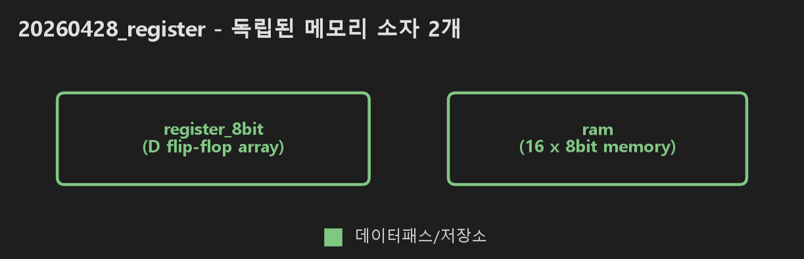

### 타이밍 다이어그램
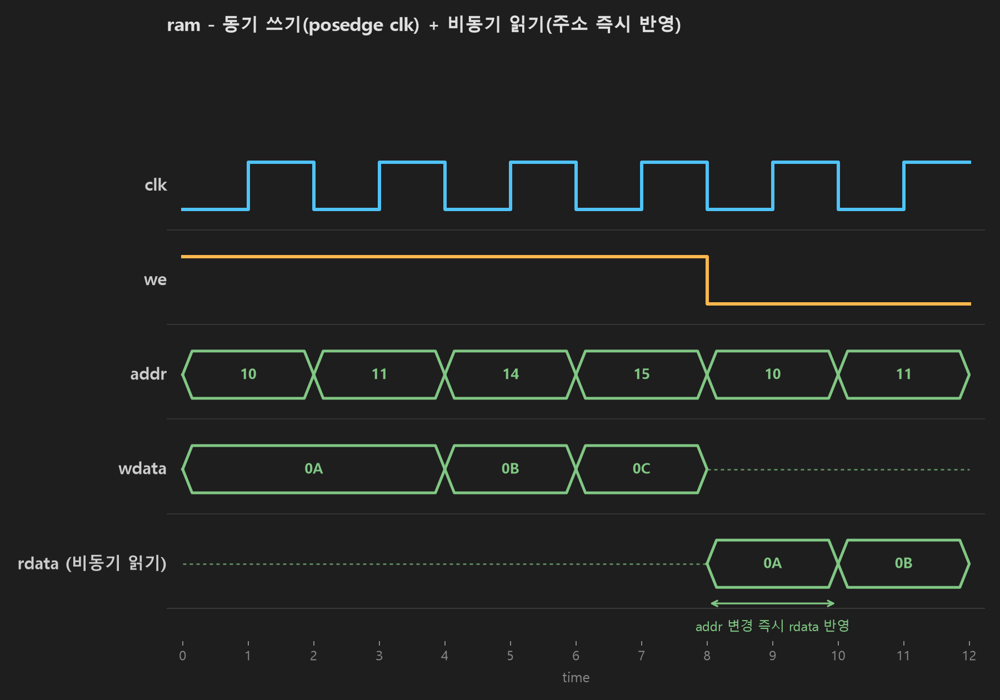

`we`가 1인 동안 클럭 엣지마다 addr에 wdata가 기록되고(동기 쓰기), we가 0으로 내려간 뒤 addr을 바꾸면 rdata가 클럭을 기다리지 않고 즉시 해당 주소의 값으로 바뀌는(비동기 읽기) 모습을 보여줍니다.

### 핵심 모듈 개념 및 사용 이유

**register vs RAM (메모리 소자의 두 형태)**
- 개념: register는 플립플롭 하나(또는 여러 개의 배열)로 "값 1개"를 저장하는 소자이고, RAM은 `reg [W:0] mem[0:N-1]` 같은 2차원 배열로 "주소로 선택하는 여러 값"을 저장하는 소자.
- 사용 이유: 이후 FIFO, 카운터의 상태 저장 등 대부분의 순차회로가 레지스터를 기반으로 하며, 여러 워드를 저장해야 하는 상황(FIFO의 저장소, 캐시, 버퍼)에는 RAM 스타일 배열이 필요하기 때문에 두 형태를 구분해 익힘.
- 핵심 동작 원리: 레지스터는 매 클럭 무조건(또는 enable 조건 하에) 갱신되고, RAM은 `we`(write enable)와 `addr`(주소)로 어느 워드를 쓸지 선택한 뒤 그 워드만 갱신한다. 읽기는 동기식(클럭에 맞춰 한 박자 늦게 나옴, 레지스터를 하나 더 씀)과 비동기식(주소가 바뀌면 조합회로처럼 즉시 반영) 두 방식이 있다.

### 검증 방법
- `tb_register.v`: 레지스터 입력 변경 후 클럭 엣지에서 값이 반영되는지 확인.
- `tb_ram.v`: we=1로 4개 주소(10,11,14,15)에 순차적으로 쓰기를 한 뒤, we=0으로 전환해 같은 주소들을 순서대로 읽어 쓴 값이 그대로 나오는지 확인하는 write-then-read 시나리오.

### 배운 점 / 주요 개념
- 레지스터(플립플롭 어레이)와 RAM(메모리 배열, `reg [W:0] mem[0:N-1]` 문법)의 구조적 차이.
- 동기 쓰기 + 비동기 읽기 조합의 RAM(주소 변경에 바로 반응)과, 동기 읽기(한 클럭 지연되지만 타이밍이 더 안정적인) 방식의 차이를 주석으로 남겨 비교해본 점 — 이후 FPGA에서 BRAM을 추론(inference)시킬 때 동기/비동기 읽기 선택이 타이밍과 자원에 미치는 영향을 이해하는 밑거름.

---

## 20260428_fifo

### 설계 목표
동기식 FIFO(First-In-First-Out)를 write/read 포인터 기반으로 직접 설계 — 이후 UART 프로젝트들에서 반복적으로 재사용되는 핵심 IP의 원형.

### 핵심 설계 결정
- `fifo`(top)를 `register_file`(저장소, 레지스터 배열 기반)과 `control_unit`(wptr/rptr, full/empty 관리)으로 분리.
- 포인터 오버플로 판별에 흔히 쓰이는 "포인터 폭을 1비트 더 늘려 MSB 비교" 기법 대신, `full_reg`/`empty_reg`라는 별도의 플래그 레지스터를 두고 push/pop 조합(`{push,pop}` 2비트 case)마다 명시적으로 갱신.
- `{push, pop}`를 하나의 case 표현식으로 묶어 2'b10(push만)/2'b01(pop만)/2'b11(동시)을 분기 처리하고, 특히 동시 push+pop일 때 "가득 찬 상태면 pop 우선, 빈 상태면 push 우선, 그 외엔 양쪽 다 진행"이라는 우선순위 규칙을 명시적으로 코딩.
- `we = (~full) & push`로 실제 쓰기 인에이블을 컨트롤 유닛이 아닌 top(`fifo`)에서 조합.

### 모듈 구조
```
fifo (top, DEPTH=4 파라미터)
├─ register_file (저장 배열, reg [7:0] mem[0:DEPTH-1])
└─ control_unit (wptr/rptr 관리, full/empty 플래그 FSM)
```

### 블록 다이어그램
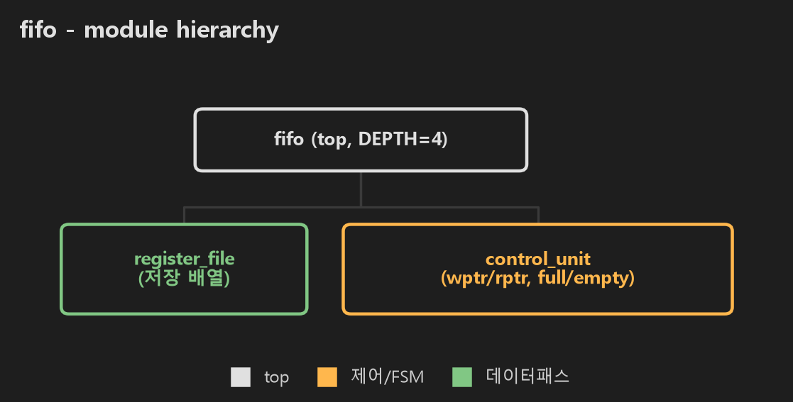

### 타이밍 다이어그램
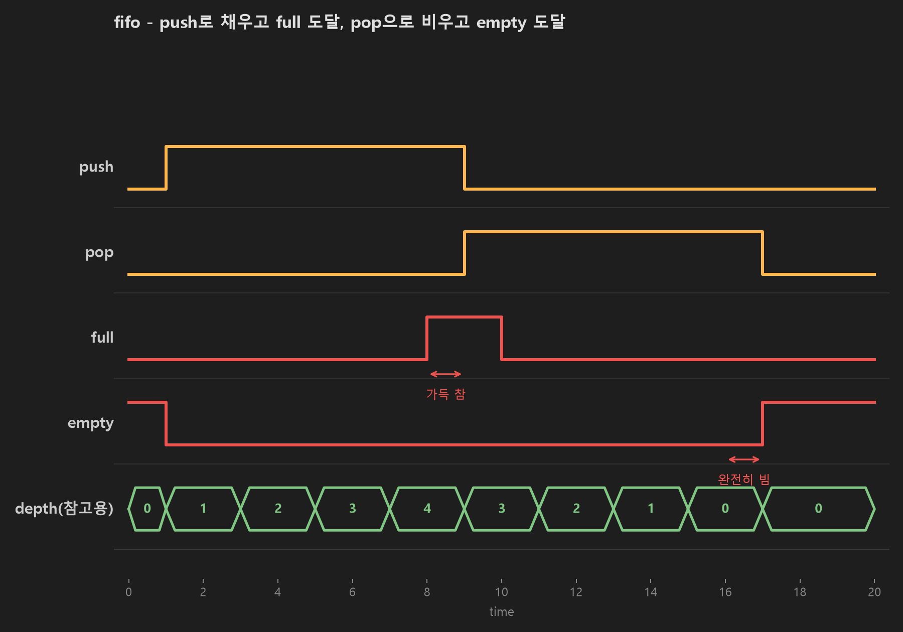

push를 4번(DEPTH=4) 반복해 full이 되는 시점과, 이어서 pop을 반복해 empty가 되는 시점을 depth(참고용) 카운트와 함께 보여줍니다.

### 핵심 모듈 개념 및 사용 이유

**FIFO (First-In-First-Out 큐)**
- 개념: 넣은 순서 그대로 꺼낼 수 있는 큐 구조의 메모리. write 포인터(wptr)가 가리키는 위치에 데이터를 넣고(push), read 포인터(rptr)가 가리키는 위치에서 데이터를 꺼낸다(pop). 두 포인터가 서로 따라잡으면 각각 full/empty가 된다.
- 사용 이유: 서로 다른 속도로 동작하는 두 블록(예: 빠른 시스템 클럭 ↔ 느린 UART 통신) 사이에서 데이터를 임시로 쌓아두는 버퍼 역할이 필요하기 때문에, 이후 모든 UART 프로젝트에서 송수신 버퍼로 재사용됨.
- 핵심 동작 원리: push마다 wptr을, pop마다 rptr을 1씩 전진시키고, wptr이 rptr을 따라잡으면 full, rptr이 wptr을 따라잡으면 empty로 판정한다. 실제 저장은 `register_file`(레지스터 배열)에 wptr/rptr 주소로 접근해 이루어진다.

### 검증 방법
- `tb_fifo.v`: (1) push만 DEPTH+1번 반복해 가득 찬 뒤 초과 push가 무시되는지, (2) pop만 DEPTH+1번 반복해 빈 뒤 초과 pop이 무시되는지, (3) push 후 곧바로 pop을 반복하는 스트리밍 패턴, 그리고 (4) `$random`으로 push/pop/push_data를 매 사이클 무작위 생성하며 `compare_data` 배열(참조 모델)에 기대값을 저장해두고 pop된 데이터와 비교해 `pass`/`fail`을 `$display`로 출력하는 자체 채점(self-checking) 랜덤 테스트까지 포함.

### 배운 점 / 주요 개념
- FIFO의 표준 구조(저장 배열 + read/write 포인터 + full/empty 플래그)와, 동시 push/pop 시 우선순위를 명시적으로 정의해야 한다는 것.
- 랜덤 테스트 + 참조 모델(reference model) 비교를 통한 자체 채점형 검증(self-checking testbench) 기법.

---

## 202260421_UART

### 설계 목표
버튼을 누르면 고정된 1바이트 데이터를 UART로 송신하는 가장 기본적인 UART TX(송신 전용) 구현. RX 없이 송신 경로만 먼저 익히는 단계.

### 핵심 설계 결정
- `uart_tx`를 IDLE→WAIT→START→BIT→STOP 5상태 FSM으로 설계 — IDLE 다음에 곧바로 START로 가지 않고 WAIT 상태를 하나 거쳐 `b_tick`(보드레이트 틱)의 다음 엣지까지 기다리게 한 점이 특징. 버튼 입력(`tx_start`)은 비동기 이벤트이므로 WAIT 상태로 한 번 동기화시켜 START 비트 폭이 항상 정확히 한 보드레이트 구간이 되도록 보장.
- `bit_count`가 6을 초과하면(즉 8번째 비트 전송 완료 시점) STOP으로 전이.
- `baud_tick_gen`은 100MHz/9600bps 기준 분주값을 파라미터로 계산해 매 비트 구간마다 1클럭 폭의 `o_b_tick` 펄스를 생성.

### 모듈 구조
```
uart (top)
├─ button_debounce (btnR → tx 시작 트리거)
├─ uart_tx (IDLE/WAIT/START/BIT/STOP FSM)
└─ baud_tick_gen (9600bps 틱 생성)
```

### 블록 다이어그램
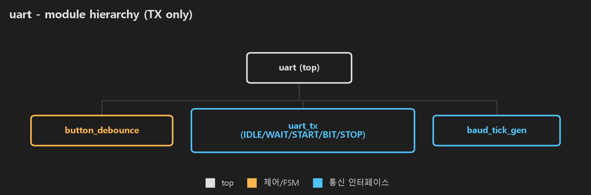

### 타이밍 다이어그램
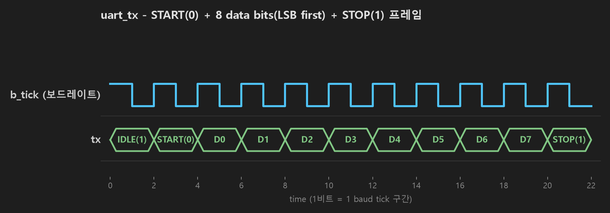

START 비트(0) → 8개의 데이터 비트(LSB부터) → STOP 비트(1)로 구성된 UART 프레임 구조를 보여줍니다. 각 비트는 정확히 하나의 보드레이트 틱(b_tick) 구간만큼 유지됩니다.

### 핵심 모듈 개념 및 사용 이유

**UART 프레임 (START/DATA/STOP)**
- 개념: 클럭 신호선 없이 데이터선 하나(tx)만으로 통신하는 비동기 직렬 통신 규약. 평소 1(idle)을 유지하다가, 0(START 비트)으로 떨어지는 것을 "지금부터 데이터가 온다"는 신호로 삼고, 정해진 개수의 데이터 비트를 보낸 뒤 1(STOP 비트)로 마무리한다.
- 사용 이유: 두 장치가 별도의 공유 클럭 없이도(각자의 정확한 보드레이트 타이밍만 맞으면) 데이터를 주고받을 수 있어, PC-보드 간 시리얼 통신에 가장 널리 쓰이기 때문에 사용.
- 핵심 동작 원리: 양쪽이 똑같은 보드레이트(예: 9600bps)로 각자 타이머를 돌려, 그 타이밍에 맞춰 한 비트씩 순서대로 싣고/읽는다. 별도의 클럭선이 없으므로 "타이밍만 맞으면 통한다"는 것이 핵심 전제.

**baud_tick_gen (보드레이트 생성기)**
- 개념: 시스템 클럭(100MHz)을 원하는 통신 속도(9600bps)에 맞는 주기의 짧은 펄스로 나누는 분주기.
- 사용 이유: UART의 각 비트가 정확히 1/9600초 동안 유지되어야 하므로, 그 시간 간격을 재는 기준 신호가 필요.
- 핵심 동작 원리: 100,000,000 ÷ 9,600 ≈ 10,417번 클럭을 세면 1비트 구간이 지난 것이므로, 그 카운트에 도달할 때마다 1클럭 폭의 펄스(b_tick)를 낸다.

### 검증 방법
- `tb_uart.v`: 리셋 해제 후 버튼(btnR)을 10,000클럭 동안 눌러 tx_start를 발생시키고, 이후 200,000클럭을 더 기다려 8비트 데이터(0x30)가 START-8bit-STOP 프레임으로 tx 라인에 실려 나가는 파형을 확인.

### 배운 점 / 주요 개념
- UART 송신 프레임 구조(START bit → 8 data bits(LSB first) → STOP bit)를 FSM으로 구현하는 표준 패턴.
- 비동기 트리거(버튼)와 자체 생성 클럭(보드레이트 틱) 사이의 타이밍을 맞추기 위해 "틱 경계까지 대기"하는 동기화 상태(WAIT)를 두는 기법.

---

## 20260424_uart_tx (uart_loopback)

### 설계 목표
이전 프로젝트의 TX-only 구현을 RX까지 확장하고, 수신한 데이터를 그대로 되돌려 보내는 UART 루프백(loopback)을 완성 — 16배 오버샘플링 기반의 정식 UART로 설계를 고도화.

### 핵심 설계 결정
- 보드레이트 틱을 `9600 * 16`으로 생성(`baud_tick_gen`)하고, RX/TX 모두 한 비트 구간마다 `b_tick`을 16번 세는 방식으로 변경 — 오버샘플링을 통해 RX가 START 비트 폭 중간(절반 지점)에서 표본을 채취하도록 하여 비트 경계 오차에 강인하게 동작.
- `uart_rx`는 IDLE에서 `rx`가 로우로 떨어지는 순간을 START 비트 시작으로 감지하고, DATA 상태에서 매 16틱마다 `{rx, data_reg[7:1]}`로 오른쪽 시프트하며 LSB부터 채우는 PISO 구조로 8비트를 조립.
- `uart_tx`는 DATA 상태에서 `tx_next = data_reg[0]`로 항상 최하위 비트를 내보내고 매 16틱마다 우측 시프트하는 PISO 방식을 채택.
- 파일 하단에 강의 중 배운 원래 버전(WAIT 상태를 두고 `bit_count`로 직접 인덱싱하는 방식)을 통째로 주석 처리해서 남겨두고, 실제로는 이를 오버샘플링 구조로 스스로 재구성한 버전을 사용.
- `uart_loopback` top은 `rx_done`을 그대로 `tx_start`에, `rx_data`를 그대로 `tx_data`에 연결하는 단 한 줄짜리 피드백 배선으로 루프백을 구현.

### 모듈 구조
```
uart_loopback (top)
└─ uart
    ├─ uart_rx (IDLE/START/DATA/STOP, 16x 오버샘플링)
    ├─ uart_tx (IDLE/START/DATA/STOP, PISO 시프트)
    └─ baud_tick_gen (9600×16 틱)
```

### 블록 다이어그램
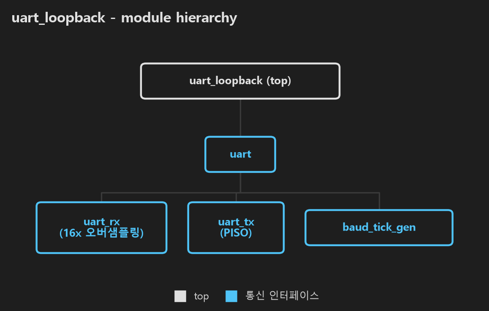

### 타이밍 다이어그램
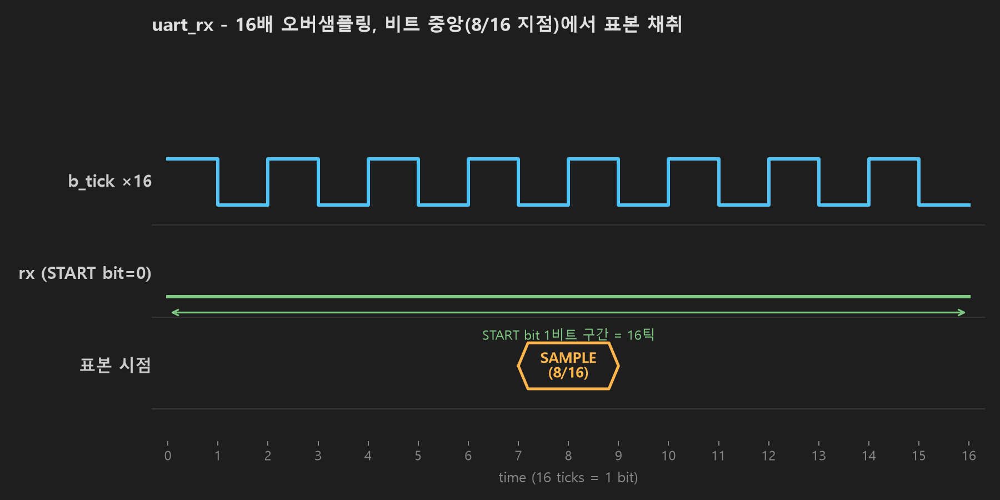

1비트 구간을 16개의 세밀한 틱으로 쪼개고, 그 중 정확히 중앙(8/16 지점)에서 표본을 채취하는 모습을 보여줍니다. 비트 경계 근처가 아닌 중앙에서 샘플링하므로 약간의 타이밍 오차에도 안정적으로 값을 읽을 수 있습니다.

### 핵심 모듈 개념 및 사용 이유

**16배 오버샘플링 & 비트 중앙 샘플링**
- 개념: 1비트 구간을 16등분한 세밀한 틱으로 나누고, 그 중 정확히 중간 지점(8/16)에서만 실제 값을 읽는 기법.
- 사용 이유: 송신 측과 수신 측의 클럭이 완벽히 같을 수 없고(수정발진기 오차), START 비트 감지 시점도 정확히 비트 경계와 일치하지 않을 수 있는데, 비트의 가장자리가 아닌 중앙에서 읽으면 이런 타이밍 오차가 누적되어도 잘못 읽을 확률이 크게 줄어들기 때문에 실제 UART IP들이 표준적으로 채택하는 기법.
- 핵심 동작 원리: 16배 빠른 내부 카운터로 각 비트 구간을 세분화하고, 카운터가 절반(8)에 도달하는 순간의 rx 라인 값을 그 비트의 값으로 확정한다.

**PISO/SIPO 시프트 레지스터 (직렬-병렬 변환)**
- 개념: 한 비트씩 순서대로 들어오거나 나가는 데이터를 레지스터를 매 비트마다 한 칸씩 밀어(shift) 병렬 데이터로 모으거나(SIPO, RX), 병렬 데이터를 한 칸씩 밀어내며 한 비트씩 내보내는(PISO, TX) 구조.
- 사용 이유: UART처럼 한 번에 1비트만 오가는 직렬 통신에서 8비트 병렬 데이터를 만들거나 내보내기 위한 가장 표준적인 방법이기 때문에 사용.
- 핵심 동작 원리: 매 비트 타이밍마다 `{새 비트, 기존값[7:1]}` 형태로 레지스터를 한 칸씩 오른쪽으로 밀어(RX, 수신) 넣거나, `data_reg[0]`을 내보내고 `{1'b0, data_reg[7:1]}`로 밀어내는(TX, 송신) 동작을 8번 반복한다.

### 검증 방법
- `tb_uart_loopback.v`: `SENDER_UART` task로 PC가 보내는 것처럼 start bit → 8 data bits → stop bit를 정확한 보드레이트 타이밍으로 `rx`에 직접 인가하는 방식을 8번 반복 — 실제 UART 송신 파형을 테스트벤치가 직접 생성해 DUT의 수신·재송신 전체 경로를 검증.

### 배운 점 / 주요 개념
- UART RX에서 표준적으로 쓰이는 16배 오버샘플링과 비트 중앙 샘플링(mid-bit sampling) 기법.
- 시프트 레지스터(PISO/SIPO)를 이용한 직렬-병렬 변환의 정석 구현.
- 강의에서 배운 초기 구현을 그대로 쓰지 않고, 문제를 스스로 찾아 오버샘플링 구조로 리팩터링한 과정.

---

## uart_text

### 설계 목표
PC 터미널에서 문자 명령(R/L/U/D/M/S)을 보내 보드를 제어하고, 반대로 보드가 상태를 "WATCH: hh:mm:ss:ms" 또는 "STOPWATCH: hh:mm:ss:ms" 형태의 아스키 문자열로 PC에 회신하는 양방향 UART 텍스트 프로토콜 구현.

### 핵심 설계 결정
- `top_uart`가 RX 경로(uart→FIFO_RX→ascii_decoder)와 TX 경로(ascii_sender→FIFO_TX→uart)를 완전히 대칭적인 두 개의 FIFO 파이프라인으로 구성.
- `ascii_decoder`는 수신 바이트를 아스키 코드값으로 직접 비교(`8'h52`='R' 등)해 6개의 원샷 명령 신호로 디코딩.
- `ascii_sender`는 IDLE/WATCH/STOPWATCH 3상태로, `data[31:0]`을 4비트씩 끊어 각 BCD 니블을 아스키 숫자로 변환하며 21바이트 문자열을 순차 생성.
- 이 프로젝트의 `fifo.v`는 이전 FIFO에서 포인터 증가 로직을 `wptr_reg + 1`(자연 오버플로에 의존)에서 `(wptr_reg == DEPTH-1) ? 0 : wptr_reg + 1`(명시적 wrap)로 수정 — TX FIFO의 DEPTH가 21(2의 거듭제곱이 아님)이기 때문에 자연 비트 오버플로에 의존하면 오작동하므로 이를 고친 개선 사항.

### 모듈 구조
```
top_uart (top)
├─ uart (uart_rx + uart_tx + baud_tick_gen)
├─ fifo U_FIFO_RX (DEPTH=4, 기본값)
├─ ascii_decoder (수신 바이트 → uart_R/L/U/D/M/S 원샷 신호)
├─ ascii_sender (IDLE/WATCH/STOPWATCH, 21바이트 문자열 생성)
└─ fifo U_FIFO_TX (DEPTH=21)
```

### 블록 다이어그램
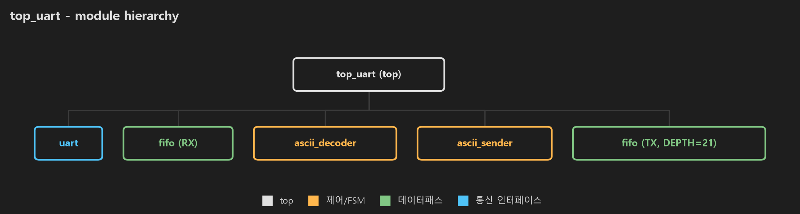

### 타이밍 다이어그램
새로 등장하는 하드웨어 타이밍 개념은 없음(UART 프레임은 202260421_UART, FIFO는 20260428_fifo에서 이미 다룸) — 이 프로젝트는 그 둘을 조합해 "문자열 프로토콜"을 만든 응용 단계이므로 별도 다이어그램은 생략합니다.

### 핵심 모듈 개념 및 사용 이유

**FIFO 기반 RX/TX 스트림 분리**
- 개념: 수신과 송신을 각각 독립된 FIFO로 감싸, UART 하드웨어의 실제 비트 타이밍과 상위 애플리케이션 로직(명령 해석, 문자열 생성)의 타이밍을 분리하는 구조.
- 사용 이유: UART는 한 바이트를 보내는 데도 수백~수천 클럭이 걸리는 반면 상위 로직은 훨씬 빠르게 동작할 수 있으므로, 그 속도차를 FIFO가 완충해 CPU 없이도 하드웨어 FSM만으로 흐름 제어가 가능해지기 때문에 사용.
- 핵심 동작 원리: RX는 "1바이트 수신 완료(rx_done)마다 FIFO에 push, 비어있지 않으면 항상 pop"으로, TX는 "송신기가 바쁘지 않고 FIFO가 비어있지 않으면 pop해서 곧바로 tx_start"로 각각 독립적으로 흐름을 관리한다.

### 검증 방법
- `tb_top_uart.v`: 실제 UART 프레임 타이밍(100MHz/9600bps → 1비트=10,416클럭)에 맞춰 R, L, U, D, M, S 각 문자를 비트 단위로 손수 `rx`에 인가해 순서대로 보내고, 이어서 select를 바꿔가며 S(status) 명령을 여러 차례 반복 전송해 WATCH/STOPWATCH 문자열 응답이 tx로 나오는지 파형 확인.

### 배운 점 / 주요 개념
- FIFO 두 개로 RX/TX 스트림을 분리하는 UART 기반 통신 프로토콜의 표준 구조.
- Verilog에는 문자열 리터럴을 직접 담는 표준 관용구가 마땅치 않아, "바이트 위치 인덱스 → 문자 코드"를 case문으로 나열하는 방식으로 텍스트 응답을 생성하는 실전 기법.
- FIFO 깊이가 2의 거듭제곱이 아닐 때는 포인터 증가에 자연 오버플로를 의존할 수 없고 명시적으로 wrap 처리를 해줘야 한다는, 실제로 겪고 고친 버그 수정 경험.

---

## project2_uart_stopwatch_watch

### 설계 목표
지금까지 만든 스톱워치/시계/UART 텍스트 프로토콜/FIFO에, 초음파 거리센서(HC-SR04)와 온습도 센서(DHT11)까지 더해 하나의 보드에서 4가지 모드(시계/스톱워치/초음파/온습도)를 스위치로 전환하며 FND에 표시하고, 동시에 버튼과 UART 명령 양쪽으로 모두 제어할 수 있는 최종 통합(캡스톤) 프로젝트.

### 핵심 설계 결정
- `top_final`을 정점으로 `top_uart`(통신), `top_fnd`(제어+데이터패스+표시), `mux_3x1`(4모드 데이터 선택)로 최상위를 구성.
- `control_unit_fsm`을 STOPWATCH/RUNSTOP/CLEAR/MODE(스톱워치)+WATCH/HOUR/MIN/SEC(시계)+SR04+DHT11까지 10개 상태로 확장하고, 모든 상태 전이 조건을 `btnR || uart_R`처럼 버튼과 UART 신호를 OR로 묶어 판단 — "물리 버튼"과 "PC에서 온 문자 명령"을 같은 이벤트로 취급.
- `sr04_controller`: IDLE→START(trig high 유지, tick_us로 12마이크로초 카운트)→WAIT(echo 상승 대기)→RESPONSE(echo 폭을 tick_us로 카운트 후 `tick_cnt_reg/58`로 cm 환산) — HC-SR04 데이터시트의 표준 트리거-에코 프로토콜을 그대로 FSM화.
- `dht11_controller`: IDLE→START(dht11 라인을 로우로 18ms 유지)→WAIT→SYNCL/SYNCH(센서 응답 동기화)→DATA_SYNC/DATA_COUNT/DATA_DECISION 루프로 40비트를 반이중 오픈드레인(`inout dht11`, `out_sel_reg`로 방향 전환)으로 수신하고 각 비트는 하이 구간 길이로 판별 — 비동기 입력을 2단 동기화 레지스터(`dht11_sync0/1`)로 안정화한 뒤 상태머신에 넣는 정석적인 CDC 처리 포함.

### 모듈 구조
```
top_final (top)
├─ top_uart (RX/TX FIFO + ascii_decoder + ascii_sender)
├─ top_fnd
│   ├─ button_debounce ×4
│   ├─ control_unit_fsm (10-state FSM, 버튼+UART 통합 입력)
│   ├─ top_stopwatch_watch (stopwatch_datapath + watch_datapath)
│   ├─ TOP_sr04_controller → sr04_controller + tick_gen_us
│   ├─ dht11_top → dht11_controller + tick_gen_us
│   ├─ fnd_controller (시계/스톱워치 표시)
│   └─ sensor_fnd (초음파/온습도 표시)
└─ mux_3x1 (4모드 데이터 → UART 응답용 32비트 데이터 선택)
```

### 블록 다이어그램
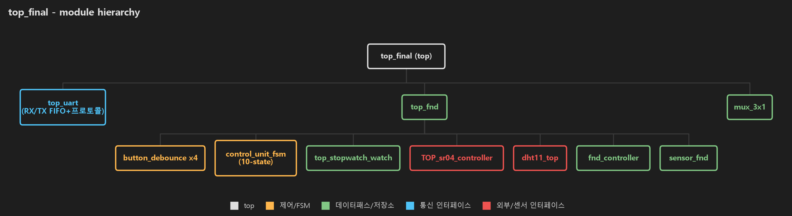

### 타이밍 다이어그램
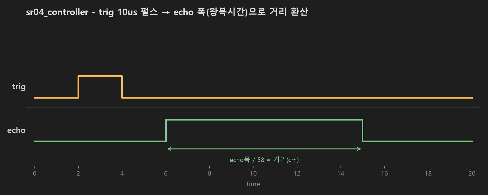

10us 폭의 trig 펄스를 보낸 뒤, 초음파가 왕복하는 데 걸린 시간만큼 echo가 High를 유지하고, 그 폭을 58로 나누면 cm 단위 거리가 되는 원리를 보여줍니다.

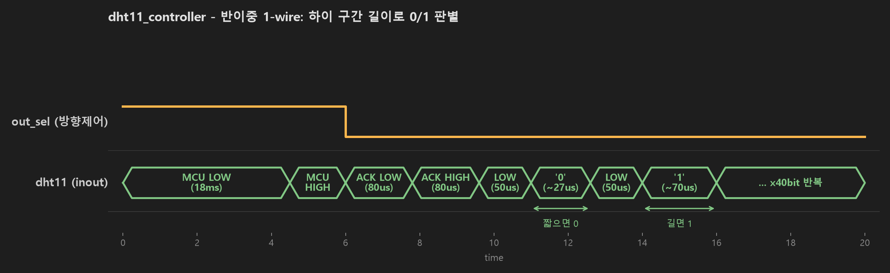

MCU가 라인을 18ms 로우로 끌어 통신을 시작하면, 센서가 80us 로우/80us 하이로 응답하고, 이후 각 비트는 50us 로우 다음에 오는 하이 구간의 길이(짧으면 0, 길면 1)로 표현되는 DHT11의 반이중 1-wire 프로토콜을 보여줍니다.

### 핵심 모듈 개념 및 사용 이유

**HC-SR04 초음파 센서 (trigger-echo 거리 측정)**
- 개념: 초음파를 쏘고(trig) 반사되어 돌아오는 데 걸린 시간(echo 펄스 폭)을 측정해 물체까지의 거리를 계산하는 센서 인터페이스.
- 사용 이유: 별도의 데이터 프로토콜 없이 펄스 폭만으로 거리 정보를 전달하는 가장 단순한 센서 인터페이스이며, "펄스 폭 측정"이라는 새로운 유형의 입력 처리 방식을 익히기 위해 사용.
- 핵심 동작 원리: trig를 10us 이상 하이로 유지해 측정을 시작시키면, 센서가 초음파를 쏘고 반사파가 돌아올 때까지 echo를 하이로 유지한다. 그 하이 구간의 길이를 마이크로초 단위 카운터로 세고, 소리의 왕복 속도(약 58us/cm)로 나누어 거리로 환산한다.

**DHT11 온습도 센서 (반이중 1-wire 프로토콜)**
- 개념: 데이터선 하나를 MCU와 센서가 번갈아 구동(반이중, half-duplex)하며, 각 비트를 "하이 구간의 길이"로 구분해 전달하는 통신 방식.
- 사용 이유: 핀 하나로 온도/습도 40비트 데이터를 모두 주고받을 수 있어 저가형 센서에 널리 쓰이며, UART와는 다른 "타이밍 기반 비트 인코딩"과 "양방향 오픈드레인" 개념을 익히기 위해 사용.
- 핵심 동작 원리: MCU가 라인을 18ms 로우로 끌어 통신을 요청하면 센서가 응답 후 40비트를 하나씩 보내는데, 매 비트마다 50us 로우 뒤에 오는 하이 구간이 짧으면(~27us) '0', 길면(~70us) '1'로 판정한다. `inout` 포트와 `out_sel_reg`로 MCU가 언제 라인을 구동하고 언제 놓아줄지(입력으로 전환)를 제어한다.

**2단 동기화 레지스터 (CDC)**
- 개념: 보드 외부에서 들어오는 비동기 신호(어느 클럭 엣지와도 무관하게 변하는 신호)를 플립플롭 2개를 직렬로 통과시켜 메타스테이빌리티(불안정한 중간 전압 상태) 위험을 낮추는 기법.
- 사용 이유: DHT11 신호는 시스템 클럭과 아무 관계 없이 변하는 외부 신호이므로, 이를 그대로 FSM에 넣으면 드물게 오동작(메타스테이블 상태가 전파)할 수 있어 안정화가 필요.
- 핵심 동작 원리: 외부 신호를 클럭 도메인으로 한 번 래치하고(1단), 그 값을 다시 한 번 래치해(2단) 안정된 신호만 실제 로직에서 사용한다.

### 검증 방법
- `tb_top_fnd.v`: top_fnd 레벨 통합 테스트.
- `tb_sr04_controller.v`: trig 발생 후 임의 시점에 echo를 인가해 거리 계산 로직 검증.
- `tb_dht11.v`: DHT11 반이중 프로토콜 타이밍을 실제 센서처럼 모사한 시퀀스로 dht11_controller 검증.
- `tb_top_uart.v`: uart_text 프로젝트와 동일한 방식으로 UART 명령/응답 프레임 검증.

### 배운 점 / 주요 개념
- 여러 서브시스템(시계류 2종 + 센서 2종 + UART)을 하나의 FSM과 mux 계층으로 통합할 때, "물리 입력"과 "원격 입력"을 이벤트 레벨에서 OR로 합쳐 같은 상태머신이 처리하게 하면 제어 로직을 이중화하지 않아도 된다는 설계 패턴.
- HC-SR04(트리거-에코)와 DHT11(반이중 1-wire) 두 가지 서로 다른 센서 프로토콜을 마이크로초 단위 tick 카운터 기반 FSM으로 구현하는 방법, 그리고 `inout` 포트와 출력 인에이블로 오픈드레인/반이중 통신을 흉내 내는 기법.
- 비동기 외부 신호를 2단 동기화 레지스터로 받아 메타스테이빌리티를 완화하는 CDC 기본기.

---

## AXI IP 관련 폴더들 (20260618_AXI4_Lite ~ 20260626_AXI_SPI_SLAVE)

이 구간은 8개 폴더(20260618_AXI4_Lite, 20260619_AXI4_Lite, 20260622_AXI_Template, 20260625_AXI_I2C, 20260625_AXI_TimerCounter, 20260626_AXI_SPI, 20260626_AXI_SPI_MASTER, 20260626_AXI_SPI_SLAVE)가 "AXI4-Lite 프로토콜을 직접 구현 → Vivado IP 패키징 템플릿으로 전환 → 실제 주변장치를 AXI 슬레이브로 패키징 → MicroBlaze SoC로 통합"이라는 하나의 학습 흐름으로 이어지는 연작이므로 함께 리뷰합니다.

### 설계 목표
AXI4-Lite 프로토콜의 5채널(AW/W/B/AR/R) 핸드셰이크를 직접 SystemVerilog로 구현해보고, 이를 Xilinx의 "Create and Package IP" 표준 템플릿에 접목해 자작 하드웨어(I2C 마스터, 타이머/카운터, SPI 마스터/슬레이브)를 MicroBlaze가 메모리 매핑으로 제어할 수 있는 AXI 주변장치 IP로 패키징하는 것.

### 핵심 설계 결정
- **20260618/20260619 (자체 구현 단계)**: `AXI4_Lite_master`와 `axi_master`/`axi_slave`를 채널별로 독립된 2-state FSM 5쌍(AW/W/B/AR/R)으로 구현. `axi_slave`는 `slv_reg0~3` 4개의 32비트 레지스터를 주소 디코딩해 읽고 쓰는 가장 단순한 메모리 맵 슬레이브.
- **20260622_AXI_Template**: Vivado IP 패키저가 생성하는 `axi_template_v1_0`(top) + `axi_template_v1_0_S00_AXI`(완전한 AXI4-Lite 슬레이브 상태기계)를 그대로 받아들여, 이후 모든 프로젝트가 이 템플릿을 복제해 커스터마이징하는 공통 뼈대로 사용.
- **20260625_AXI_TimerCounter**: 템플릿의 `slv_reg0~3`을 각각 제어/분주값/자동재로드값/카운트값으로 해석해 실제 `TimerCounter` 모듈에 연결.
- **20260625_AXI_I2C, 20260626_AXI_SPI_MASTER/SLAVE**: 기존에 검증된 I2C·SPI 모듈을 axi_template에 연결해 AXI 슬레이브화.
- **20260626_AXI_SPI**: 위에서 만든 uart/gpio/timer/spi_master/spi_slave AXI IP들을 `ip_repo`에 패키징해두고, Vivado IP Integrator(블록 디자인)로 MicroBlaze + AXI Crossbar + 각 커스텀 IP + clk_wiz + BRAM(LMB)을 연결한 완전한 SoC를 구성.

### 모듈 구조
```
[학습 단계] AXI4_Lite_master / axi_master / axi_slave  (자체 구현 FSM 기반 AXI4-Lite)
        ↓
[템플릿 전환] axi_template_v1_0 → axi_template_v1_0_S00_AXI (Vivado IP 패키저 표준 템플릿)
        ↓
[페리페럴화] axi_template_v1_0_S00_AXI + { TimerCounter | i2c_master | spi_master | spi_slave_top }
        ↓
[SoC 통합] axi_spi (Block Design) : MicroBlaze + AXI Crossbar + clk_wiz + LMB BRAM
           + AXI 커스텀 IP(uart_v1_0, gpio_v1_0, timer_v1_0, spi_master_v1_0, axi_spi_slave_v1_0)
```

### 블록 다이어그램
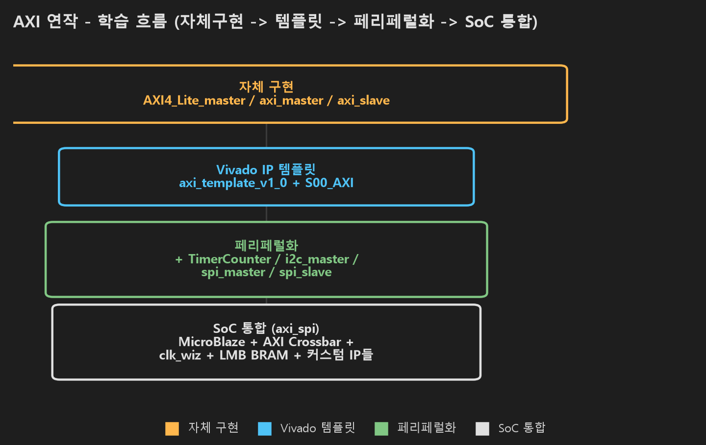

### 타이밍 다이어그램
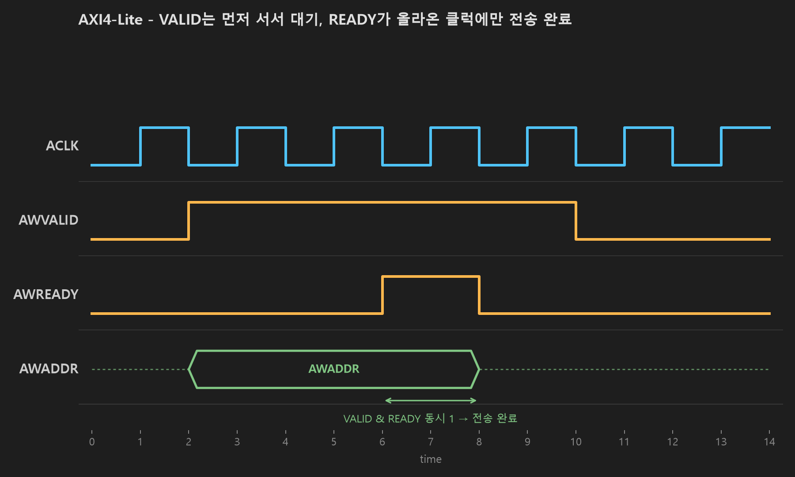

AWVALID가 먼저 올라가 대기하다가, AWREADY가 올라오는 클럭에서만 실제 전송이 이루어지는(VALID & READY 동시 1) AXI4-Lite의 기본 핸드셰이크 규칙을 보여줍니다. AW/W/B/AR/R 5개 채널 모두 이 규칙을 독립적으로 따릅니다.

### 핵심 모듈 개념 및 사용 이유

**AXI4-Lite VALID/READY 핸드셰이크**
- 개념: 데이터를 보내는 쪽이 VALID(보낼 데이터가 준비됐다)를, 받는 쪽이 READY(받을 준비가 됐다)를 각각 독립적으로 올리고, 두 신호가 동시에 1인 클럭 엣지에만 실제 전송이 완료된 것으로 간주하는 프로토콜 규칙.
- 사용 이유: 송신자와 수신자의 준비 시점이 서로 다를 수 있는 상황(수신자가 바쁠 수도 있음)에서, 고정된 타이밍 없이도 유연하게 데이터를 주고받기 위해 AXI뿐 아니라 대부분의 온칩 버스 프로토콜이 채택하는 표준 방식.
- 핵심 동작 원리: VALID를 올린 쪽은 READY가 올라올 때까지 값을 유지해야 하며(값을 도중에 바꾸면 안 됨), READY를 받는 쪽은 아무 때나 자기 사정에 맞춰 READY를 올릴 수 있다. 두 신호가 같은 클럭에서 모두 1일 때만 "이번 클럭에 전송 성공"으로 확정된다.

**AXI IP 패키징 템플릿 (slv_reg + 사용자 로직)**
- 개념: Vivado가 자동 생성해주는 AXI4-Lite 슬레이브 상태기계(주소 디코딩, 바이트 스트로브 처리, 응답 생성까지 모두 포함)에 사용자가 레지스터 의미(제어/상태/데이터)만 정의해 끼워 넣는 반제품 코드.
- 사용 이유: AXI 프로토콜 자체를 매번 손으로 구현하는 것은 반복 작업이자 실수 여지가 크므로, 실무에서는 검증된 템플릿에 "이 레지스터가 무엇을 뜻하는지"만 추가하는 방식으로 개발 속도와 신뢰성을 높이기 위해 사용.
- 핵심 동작 원리: 템플릿이 만들어주는 `slv_reg0~3`(또는 그 이상) 레지스터에 사용자가 원하는 필드(예: 제어 비트, 카운트 값)를 매핑하고, 그 레지스터 값을 실제 커스텀 하드웨어(I2C, 타이머 등)의 입력으로 연결하기만 하면 AXI 주변장치가 완성된다.

### 검증 방법
- `tb_AXI4_Lite_master.sv`, `tb_axi_master_slave.sv`: `axi_write`/`axi_read` 태스크로 마스터-슬레이브 쌍을 직접 연결해 레지스터 쓰기 후 읽어서 값이 일치하는지 확인.
- `tb_axi_slave.sv`, `tb_TimerCounter.sv`, `tb_axi_timer.sv`: 각각 슬레이브 단독, TimerCounter 단독, AXI로 감싼 타이머 전체를 레지스터 write/read 시나리오로 검증.

### 배운 점 / 주요 개념
- AXI4-Lite의 5개 독립 채널 각각이 독립적인 valid/ready 핸드셰이크 FSM으로 동작한다는 프로토콜 구조를 직접 구현해보며 체득.
- 실무에서는 이 프로토콜 로직을 매번 손으로 짜지 않고 Vivado의 IP 패키징 템플릿을 사용한다는 실전 워크플로우.
- 커스텀 하드웨어를 메모리 매핑 레지스터로 감싸 소프트 프로세서(MicroBlaze)가 제어할 수 있는 "AXI 주변장치 IP"로 만드는 전체 파이프라인(RTL 설계 → IP 패키징 → Block Design 통합 → 주소 맵 할당)을 처음부터 끝까지 경험.

---

## rps-work

※ 이 프로젝트는 나머지와 달리 Verilog/Vivado FPGA 프로젝트가 아니라 Jetson 보드용 Python on-device AI 예제 모음이라, 타이밍 다이어그램 항목은 하드웨어 파형 대신 "처리 파이프라인" 관점으로, 핵심 모듈 개념 항목은 소프트웨어 개념 중심으로 조정해 정리합니다.

### 설계 목표
가위바위보(RPS) 손동작을 카메라로 인식하는 문제를 놓고, "CNN 이미지 분류(MobileNetV2, TensorRT)" → "객체 검출(YOLO, ultralytics)" 두 가지 On-Device AI 접근법을 Jetson 보드에서 각각 구현·비교하고, 별도로 Jetson에서 로컬 LLM(Ollama)을 구동해보는 실습 모음.

### 핵심 설계 결정
- **CNN 분류 방식**: `cvzone.HandTrackingModule`로 먼저 손을 검출해 바운딩 박스를 얻고, 그 영역만 정사각형으로 패딩/리사이즈한 뒤 224×224 크기로 정형화해 MobileNetV2 분류기에 입력 — "검출로 관심영역을 좁히고 분류기는 그 안의 클래스만 맞춘다"는 2단계 파이프라인.
- `trt_module.py`의 `TRTInferenceEngine`은 TensorRT 10.x API 기준으로 작성하고, `pycuda.driver.pagelocked_empty`로 CPU/GPU가 물리 메모리를 공유하는 zero-copy 버퍼를 할당 — 매 프레임마다 host↔device 메모리 복사를 하지 않도록 하여 임베디드 보드에서 지연시간을 최소화.
- **객체 검출 방식**: 별도의 손 검출 전처리 없이 사전학습/파인튜닝된 YOLO가 검출과 분류를 한 번에 수행하도록 구조를 단순화.
- **LLM 실습**: `ollama` 파이썬 클라이언트로 로컬에 내려받은 `gemma3:4b` 모델을 `stream=True`로 호출해 토큰 단위 스트리밍 응답을 받는 예제.

### 파일 구성
```
rps-work/examples/
├─ 03_CNN_Based_On-Device_AI/  (MobileNetV2 + TensorRT, 손 검출 후 분류)
├─ 04_Object_Detection_Based_On-Device_AI/  (YOLO 기반 검출+분류 통합)
└─ 05_LLM_On-Jetson/  (Ollama 로컬 LLM 스트리밍 예제)
```

### 블록 다이어그램
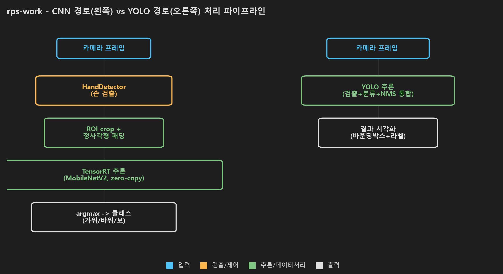

### 처리 파이프라인 (타이밍 다이어그램 대체)
하드웨어 신호 타이밍 대신, 프레임 하나가 처리되는 소프트웨어 파이프라인 순서로 대체합니다.

- **CNN 경로**: 카메라 프레임 → 손 검출(HandDetector) → ROI crop & 정사각형 패딩 → TensorRT 추론(zero-copy) → argmax로 클래스 결정 → 화면에 박스/텍스트 오버레이.
- **YOLO 경로**: 카메라 프레임 → YOLO 추론(검출+분류+NMS를 한 번에) → 결과 시각화.
- CNN 경로가 "검출→크롭→분류"의 3단 파이프라인인 반면 YOLO 경로는 "검출+분류 통합" 1단 파이프라인이라는 구조적 차이가, 각 코드의 길이와 복잡도 차이로 그대로 드러납니다.

### 핵심 모듈 개념 및 사용 이유

**TensorRT 추론 엔진 (zero-copy 버퍼)**
- 개념: 학습된 신경망을 GPU에서 가장 빠르게 실행되도록 최적화·컴파일한 실행 파일(.engine)과, 그것을 구동하는 런타임.
- 사용 이유: Jetson처럼 자원이 제한된 임베디드 GPU에서 실시간(수십 FPS) 추론이 가능하려면 범용 프레임워크보다 하드웨어에 특화된 컴파일 최적화가 필요하기 때문에 사용.
- 핵심 동작 원리: CPU와 GPU가 물리 메모리를 공유하는 Jetson의 특성을 활용해, 입력 데이터를 GPU로 복사하는 과정 없이(zero-copy) 바로 추론을 실행하고 결과도 복사 없이 읽어온다.

**검출 후 분류(2단) vs 통합 검출기(1단) 아키텍처**
- 개념: 문제를 "위치 찾기(검출)"와 "무엇인지 알아내기(분류)"로 나누어 순차 처리할지, 하나의 신경망이 둘을 동시에 처리하게 할지에 대한 구조적 선택.
- 사용 이유: 2단 방식은 각 단계를 독립적으로 튜닝·교체하기 쉽고, 1단(YOLO 등) 방식은 구현이 단순하고 지연시간이 짧다는 트레이드오프가 있어, 같은 문제를 두 방식으로 만들어보며 그 차이를 직접 비교하기 위해 사용.
- 핵심 동작 원리: 2단 방식은 검출기의 출력(바운딩 박스)을 분류기의 입력으로 다시 가공(crop/resize)해 넘겨야 하는 반면, 1단 방식은 원본 프레임을 그대로 넣으면 검출+분류 결과가 한 번에 나온다.

### 검증 방법
- 별도의 자동화된 테스트 코드는 없고, 웹캠으로 실시간 프레임을 받아 화면에 분류 결과/바운딩 박스/FPS를 직접 띄워 육안으로 정확도와 속도를 확인하는 실기(demo) 검증 방식.

### 배운 점 / 주요 개념
- 임베디드 GPU(Jetson)에서 딥러닝 추론을 가속하는 표준 경로(모델 학습 → ONNX 변환 → TensorRT 엔진 빌드 → zero-copy 버퍼로 추론)를 처음부터 끝까지 경험.
- 같은 문제(RPS 인식)를 "검출+분류 2단계 파이프라인"과 "통합 검출기(YOLO) 1단계"로 각각 구현해보며 On-Device AI 아키텍처 선택의 트레이드오프를 체감.
- 온디바이스 실시간 비전 애플리케이션에서는 정확도뿐 아니라 FPS(처리량)를 항상 함께 측정·보고해야 한다는 습관.
- 로컬 LLM(Ollama)의 스트리밍 응답 API 사용법 — FPGA/HDL 트랙과는 별개로 소프트웨어 쪽 On-Device AI(엣지 LLM) 영역까지 학습 범위를 넓힌 부분.

---
